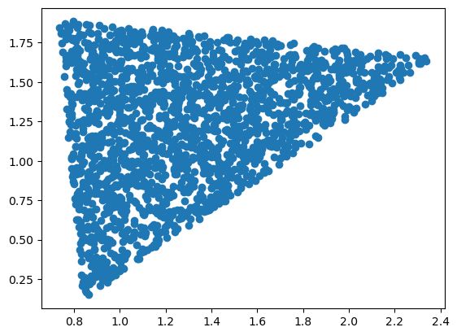

# geography


<!-- WARNING: THIS FILE WAS AUTOGENERATED! DO NOT EDIT! -->

## Install

``` sh
pip install geography
```

## How to use

``` python
import numpy as np
import matplotlib.pyplot as plt
from scipy.spatial import ConvexHull

from geography.core import RGG
```

### create a random geometric graph

we can specify the law (support binomial and Poisson), a convex polytope
in which vertices live, the average number of points and the connection
radius.

``` python
rgg = RGG(n=2000, r=0.05, d=2, shape=ConvexHull(np.random.default_rng().uniform(0,1,(5,2))*3), law="poisson")
```

supported statitics

- `adj`: adjacency list  
- `degree_distribution`  
- `n_comp`: number of component  
- `n_tri`: number of triangles  
- `cyclic`: bool of whether the graph is cyclic

for instance

``` python
plt.bar(*rgg.degree_distribution().T)
```


### Inspect the points

Under the hood, `RGG` has the `V` (standing for vertices) attribute
which is implemented as a `Points` object. We can inspect the
coordinates of `V` as follows

``` python
plt.scatter(*rgg.V.points.T)
```



Every `Points` object come with a few methods

- `distance_matrix()`: pairwise distance of points
- `lnnl(k)`: largest k-nearest neighbour link defined by $$
  L_k = \inf\{r: \deg(x)\ge k,  \forall x\in G(V,r) \}
  $$
- `connectivity_threshold()`: $$
  M = \inf\{r: G(V,r) \text{ is connected}\}.
  $$

``` python
rgg.V.lnnl(k=1)
```

    0.04809040392058131

``` python
rgg.V.connectivity_threshold(output_lnnl=False)
```

    0.057453595670079224
